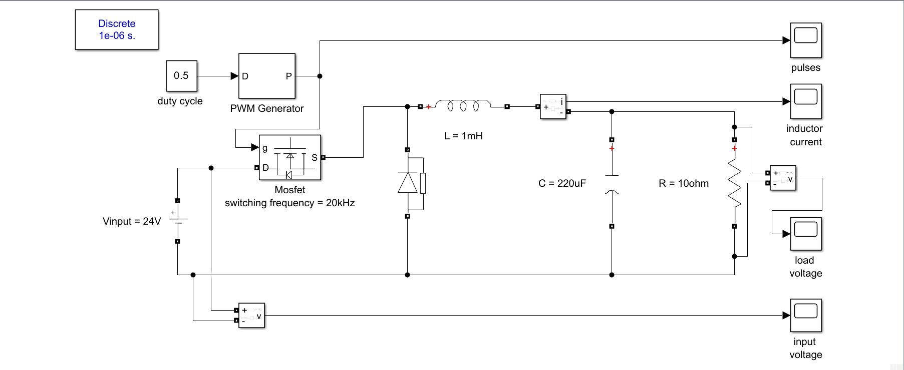

<<<<<<< HEAD
# Buck Converter Simulation in MATLAB/Simulink

##  Project Overview
This project demonstrates the simulation of a **Buck Converter (DC-DC step-down converter)** using MATLAB/Simulink.  
The buck converter reduces a higher DC voltage (24V) to a lower DC voltage (~12V) using **PWM (Pulse Width Modulation)** control.

This is my **first project** in MTech Electric Vehicle Technology portfolio.

---

##  Model Details
- **Input Voltage:** 24V DC  
- **Switching Frequency:** 20 kHz  
- **Duty Cycle:** 50%  
- **Inductor (L):** 1 mH  
- **Capacitor (C):** 220 µF  
- **Load Resistor (R):** 10 Ω  
- **Simulation Time:** 1 s  

---

## 📊 Results
- Input Voltage = 24V DC  
- Output Voltage ≈ 12V DC (with LC filter smoothing)  
- Inductor current shows ripple but average remains steady.  

---

## 📸 Screenshots
**Circuit Diagram**  
  

**Output Voltage Waveform**  

**Input Voltage Waveform**
 

**Inductor Current waveform**

**Pulse Generator waveform**

---

## How to Run
1. Open `buck_converter.slx` in MATLAB Simulink.  
2. Run the simulation for **1 second**.  
3. Observe input and output waveforms on the Scope.  

---

## Learning Outcome
- Understood MOSFET switching & PWM control.  
- Designed and simulated a **buck converter**.  
- Gained confidence in using MATLAB/Simulink for EV power electronics.  

---

## Next Step
Next project in this portfolio → **DC Motor Speed Control in MATLAB Simulink**
=======
# EV-Projects
MTech EV Technology Projects (Power Electronics, BMS, Motor Drives, AI/ML)
>>>>>>> 7567d25c3e7f3d860f4e8d2baa789ae974e315d6
